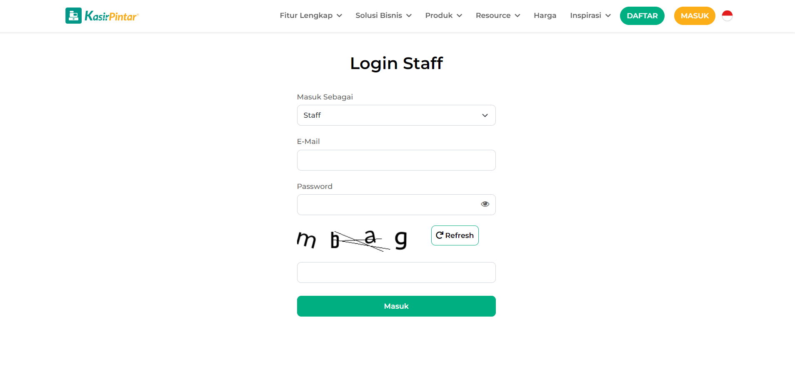
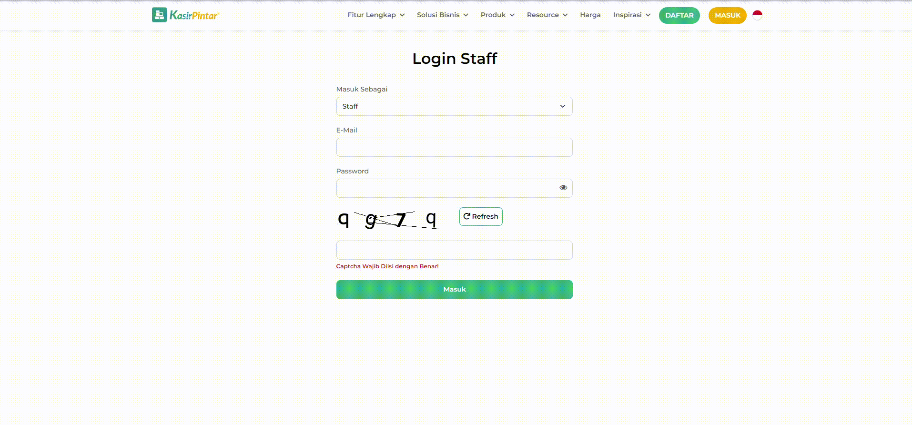

# 📥 Otomasi Login dengan CAPTCHA


## 🎯 Deskripsi
Proyek ini adalah solusi otomasi login untuk situs web yang memerlukan CAPTCHA sebagai bagian dari proses otentikasi. Dengan menggunakan Selenium untuk mengotomatiskan pengisian formulir dan teknik OCR (Optical Character Recognition) untuk memecahkan CAPTCHA, proyek ini menawarkan metode efektif untuk menangani proses login yang menantang.

Fitur Utama:

Auto-Fill: Mengisi field email dan password secara otomatis.
CAPTCHA Solver: Menyelesaikan CAPTCHA dengan akurasi tinggi menggunakan preprocessing gambar dan OCR.
Automasi Penuh: Menangani seluruh proses login termasuk interaksi dengan elemen-elemen dinamis.

## 📚 Daftar Library
Proyek ini menggunakan berbagai library Python untuk mengotomatiskan proses login:

- requests: Mendownload gambar CAPTCHA.
- Pillow (PIL): Manipulasi gambar.
- pytesseract: Optical Character Recognition (OCR) untuk menyelesaikan CAPTCHA.
- selenium: Automatisasi interaksi dengan browser.
- opencv-python: Pemrosesan dan preprocessing gambar untuk meningkatkan akurasi OCR.
- numpy: Manipulasi array gambar.

## 🚀 Instalasi

1. Instal Dependensi:
```bash
pip install requests pillow pytesseract selenium opencv-python numpy
```

2. Instal Tesseract-OCR:
- Unduh dan instal **Tesseract-OCR** sesuai petunjuk untuk sistem operasi Anda.

3. Unduh Chromedriver:
- Unduh **ChromeDriver** yang sesuai dengan versi Chrome Anda.

## 🎬 Cara Penggunaan

1. Konfigurasi Tesseract
2. Jalankan script

## 📝 Catatan

- CAPTCHA yang diambil dari form langsung mungkin memberikan hasil yang berbeda dari yang diunduh dari URL API. Teknik preprocessing gambar dirancang untuk mengatasi tantangan ini.

- Pastikan versi library dan driver browser Anda sesuai dengan sistem Anda untuk menghindari masalah kompatibilitas.

## 📸 Contoh Hasil



